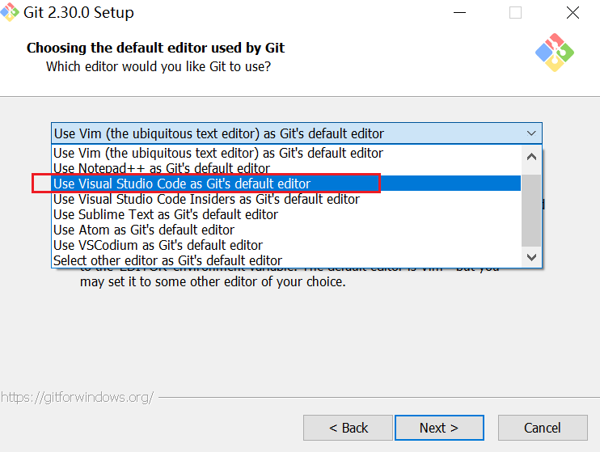
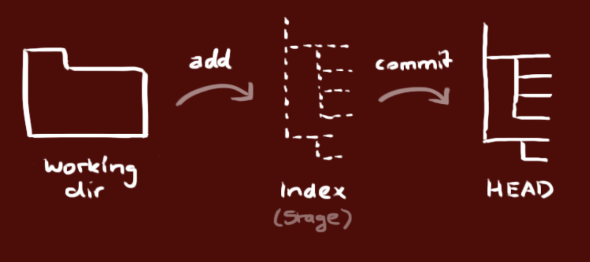
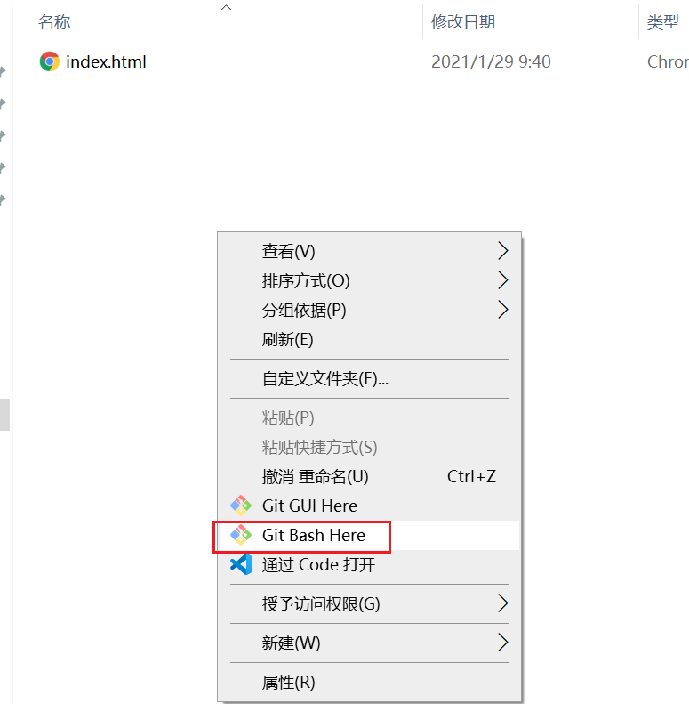
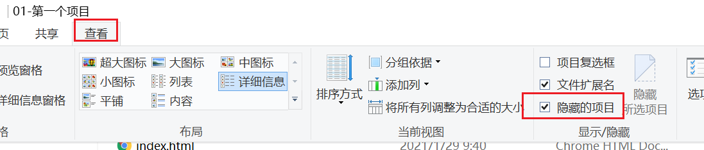
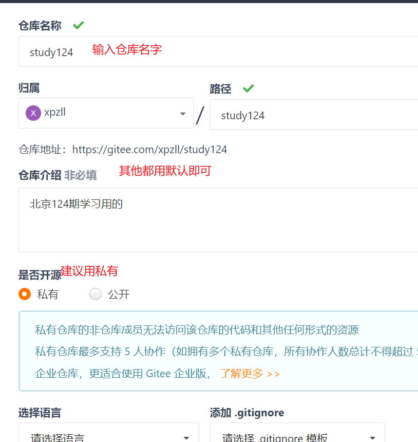
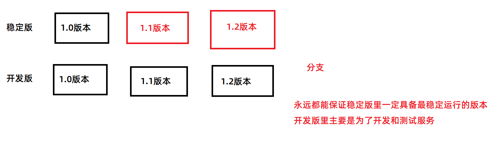
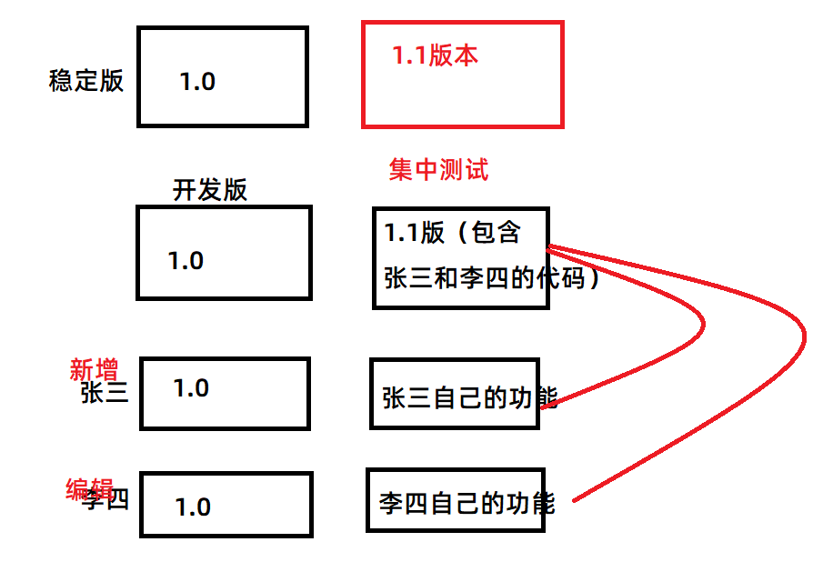
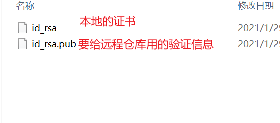
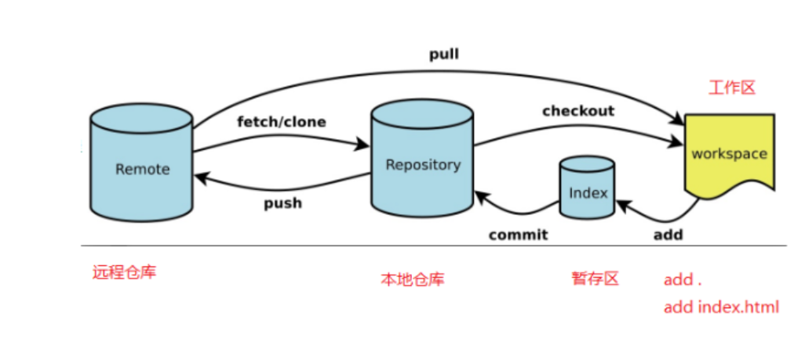

## 复习前天内容

- 图片预览
  - file元素有个change事件，会在选择的文件发生改变以后触发
  - 在这个事件里拿到选择的图片 this.files[0]
  - 转成临时路径：URL.createObjectURL(this.files[0])
  - 把临时路径赋值给img的src即可
- FormData
  - 它是一个对象，所以用的时候要实例化
  - 实例化的时候如果传入了一个表单对象（DOM对象）
  - 它就可以获取到这个表单里所有带name属性的表单元素的值
  - 并且name的值就是参数名
  - 如果表单里的数据不够，我们还要额外加一些参数
    - FormData的append方法来添加参数
      - 参数1：参数名
      - 参数2：参数值
  - 如果用了FormData，在原生ajax里
    - 就不用再设置请求头，因为FormData会自动设置专属于它的请求头
    - 而且直接在 send 方法里传递FormData对象即可
  - FormData在jquery里的使用
    - 默认会报错
    - 要加两句话：
      - contentType:false
      - processData:false
- jquery里的serialize方法
  - 把表单里所有带name属性的表单元素的值给取到
  - 组成key=value形式的字符串，不会包含文件


## git介绍

- git就是一个代码版本的管理工具
- 假设以后开发代码，有n多个版本
  - 1.0
  - 1.1
  - 1.2
  - .....
  - 2.0
  - 万一以后有100个版本，就得复制100个文件夹，很不方便管理，并且也不好对比每个版本的代码差异，而且万一哪天我在写代码的过程中，我突然口渴去喝水，但是我的猫突然踩到键盘上，加了好多我不想要的乱码，所以又得自己慢慢删，所以也就是说不方便删除
- 如果有了git，它就能解决上面的问题：
  - 就算有100个版本，也可以让它只在1个文件夹
  - 很方便让我们看到代码的差异
  - 可以很方便帮我们恢复代码
  - .......
- 企业中的真实开发，一般都会用git来把代码管理起来

## git安装

[git官网](https://git-scm.com/)

- 基本上点下一步下一步直到完成即可
- 但是在这一步，建议大家选择第三个：也就是 Use Visual Studio Code
  - 
  - 因为这个代表如何打开配置文件，选第三个就代表以后想查看配置文件，默认会用vscode帮我们打开配置文件

## git配置邮箱和用户名

- 邮箱和用户名，一个是为了验证你有没有修改这个代码的权限，一个是为了标识你是谁

- 设置命令

  ```bash
  git config --global user.email "邮箱"
  git config --global user.name "用户名"
  ```

  - 以后企业里面让你设置什么邮箱你就设置什么邮箱

- 打开配置文件直接修改

  ```bash
  git config --global --edit
  ```

  - 如果你安装时选的不是vscode打开配置文件，那么可能你不会操作
  - 那么你也可以专门去找到git的配置文件，然后再用vscode打开这个配置文件，再来修改也可以
  - 路径在： c:\users\你的电脑名\\.gitconfig 

  

- 查看当前的配置

  - 用命令查看

    ```BASH
    git config --global --list
    ```

    


## git三大区域




- git可以理解为是一个仓库
  - 工作区：就是仓管人员工作的地方（比如说打包物品、贴上标签等）
  - 暂存区：我打包好一个东西，就暂时把这个东西放到拖车上存储
  - 记录区：相当于仓库里的货架，我把暂存区里的东西（也就是拖车里的东西）移入到货架上


- 所以我们后面用git管理代码就要这样做：
  - 自己写代码
  - 把代码添加到暂存区
  - 把暂存区里的代码统一提交到记录区

## git初始化本地仓库

- 初始化仓库的意思就是说：让咱们的这个代码文件夹被git管理起来

- 来到需要被git管理的代码文件夹里，右键，选择 `git bash here`

  

  

- 命令

  ```bash
  git init
  ```

  - 如果成功，会在这个目录里生成一个 `.git` 的文件夹
  - 这个就是我们创建好的“代码仓库”，所有代码的改动记录都会存在这个仓库里


- .git文件夹说明
  - 它是一个隐藏文件夹，所以如果你电脑没有开启查看隐藏文件夹，是看不到的
    - 
  - 这个文件夹里包含`暂存区` 和 `记录区`，所以也就意味着，如果想查看我的代码有哪些版本记录，或者想恢复记录等等功能，就需要这个文件夹，这个文件夹如果被删，就不会再有记录了，这就好比是你把仓库炸了


## git查看状态与比对状态

- 命令

  ```bash
  git status
  ```

- git可以比对我的代码改动

  ```bash
  git diff 
  ```

  - 默认会找到所有加入到暂存区文件的改动
  - 如果只想查看某个文件的改动，那么输入以下命令

  ```bash
  git diff 文件名
  ```

  - 注意：只能查看到被git管理起来的（加到暂存区的文件）文件的变动


## git移入暂存区

- 命令

  ```bash
  git add 文件名
  ```

  - 只能一次移动一个
  - 如果想移动所有文件到暂存区，那么可以用 . 来替换

  ```bash
  git add .  
  ```

  - 代表添加所有文件到暂存区


## git将改动提交成记录

- 命令

  ```bash
  git commit -m"这次记录的备注"
  ```

  

## git查看记录版本

- 命令：

  ```bash
  git log
  ```

  

## git版本回滚

- 把被git管理的代码恢复到指定的记录去

  ```bash
  git reset --hard 记录的hash值
  ```

  - 记录的hash值是我们敲 `git log` 看到的每条记录的hash值
  - 这个hash值都是唯一的，所以通过这个hash值就可以代表某个记录的版本

- --hard 代表代码也跟着滚到对应的记录去

  - 如果不加--hard，它会回滚，但是你后面记录里写的代码还在

- 回滚到上一个版本

  ```bash
  git reset --hard HEAD^
  ```

  - 一个^代表上一个记录，两个^代表上上记录，三个^就是上上上记录，依次类推


## 查看所有记录

- git log默认只能查当前记录和它前面的记录，但是查不到所有记录

- 要想查看所有记录，用以下命令

  ```bash
  git reflog
  ```

  - 然后就可以从早期的版本，回滚到最新的版本了，回滚的命令还是一样的


## 简略查看记录

```bash
git log
```

- 上面这个命令太长了
- 每次查看不方便，所以要想查看简略信息，那么可以用以下命令

```bash
git log --oneline
```

- 意思是：所有记录一行显示，包括得到的hash值也是简略版本
- 简略版本hash值也可以用，用法依然是 git reset --hard hash值


## git放弃当前修改

- 有的时候可能写了很多代码，但不是我们自己想要的

- 或者有的时候我的代码，写着写着突然被别人、被动物、被猫踩到键盘加了一堆乱七八糟的东西

- 那么这个时候我就要对git说：放弃这次修改，它就能恢复到上一个暂存的代码了

- 前提：先暂存过之前的代码

- 放弃修改，就能恢复到上次暂存的代码了

- 命令

  ```bash
  git restore .
  ```

  - 这里的 . 是指所有文件都放弃当前修改
  - 也可以指定某个文件放弃当前修改

  ```bash
  git restore 具体的文件名
  ```

  - 只放弃这个文件的修改

  

## 总结本地操作git仓库

- 首先需要初始化一个git仓库

  ```bash
  git init
  ```

- 查看当前仓库的状态

  ```bash
  git status
  ```

  - 查看哪些文件被修改，以及哪些文件还没被git管理起来

- 如何把文件的操作修改加到暂存区里

  ```bash
  git add .
  ```

  - 把所有文件加入到暂存区
  - 也可以指定某个文件加到暂存区

  ```bash
  git add 文件名
  ```

- 提交到记录区

  ```bash
  git commit -m"本次记录的说明"
  ```

- 回滚记录

  ```bash
  git reset --hard 记录的hash值
  ```

  - --hard代表除了记录回滚，代码也会跟着回滚
  - 如果不加--hard，那么记录会回滚，但是代码不跟着回滚

- 查看记录版本

  ```bash
  git log
  ```

  - 查看当前记录和它之前的记录
  - 它默认是完整显示，如果想一行显示简略版本，用

  ```bash
  git log --oneline
  ```

- 查看所有记录

  ```bash
  git reflog
  ```

- 放弃修改

  ```bash
  git restore .
  ```

  - 放弃所有文件修改，恢复到上一个暂存区代码
  - 也可以指定某个文件放弃修改

  ```bash
  git restore 文件名
  ```

  - 它也可以恢复误删的文件

- 比较文件的差异

  ```bash
  git diff .
  ```

  - 比较所有文件的差异

  ```bash
  git diff 具体文件
  ```

  - 比较具体文件的代码改动

  

## 远程仓库

- 就是一个放代码的服务器
- 只不过这个服务器可以用来给多个开发者下载代码、提交代码、记录代码的版本
- 比较出名的远程仓库：github、gitee（码云）
- 有些公司还会自己搭建远程仓库服务器里面去


## 创建空仓库并提交本地文件

- 

  

- 如何把本地文件推送到远程仓库

- 先去本地仓库跟远程仓库建立连接

  ```bash
  git remote add origin 远程仓库地址
  ```

  - remote add 添加远程仓库连接的意思
  - origin就是远程仓库的别名，也可以叫别的名字，但是建议叫origin，以后用origin就代表了这个远程仓库

- 把本地代码推送到远程仓库

  ```bash
  git push -u origin master
  ```

  - 如果你远程仓库没叫origin，那么你就把origin改成你起的名字
  - 如果本地仓库没有任何提交记录，你推送会报错，所以记得先在本地至少有一条记录（commit）


## 已有仓库克隆到本地

- 如果是已经存在了远程仓库，我需要在这个仓库已经有代码的基础上再写功能

- 我们需要先把远程仓库的代码克隆下来，命令如下：

  ```bash
  git clone 仓库地址
  ```

- 如果克隆下来后，我们自己就不用再git init初始化仓库了，因为它肯定已经初始化过了

- 就按自己的功能去写代码

- 写完代码记得 `加入暂存区` 和 `提交记录`

- 提交完记录，就可以把当前的记录推送到服务器去了

  ```bash
  git push 
  ```

  - 当然你也可以写完整版 git push -u origin master


## 分支branch

- 为什么要有分支？

  - 可以做不同的备份、方便实际使用
  - 而且开发时使用不同分支，那么可以让代码互不影响，而且更利于管理

  

  

- 获取分支

  ```bash
  git branch
  ```

  - 一个项目一旦初始化git，就默认具备一个分支，这个分支叫 `master`
  - 在开发中，我们一般也会把 `master` 称之为主分支
  - `主分支` 里的代码，放的一般都是稳定运行的版本


- 创建分支

  ```js
  git branch 分支名
  ```

  - 例：git branch dev
  - 就是创建一个分支叫dev
  - 细节：在哪个分支里新建的分支，那么新建出来的分支会包含这个分支里的内容

  

- 切换到某个分支

  ```bash
  git checkout 分支名
  ```

  - 例： git checkout dev
  - 就是切换到dev分支


- 新建分支并切换过去

  ```bash
  git checkout -b 分支名
  ```

  - 例： git checkout -b dev3
  - 以当前分支为基础，新建dev3分支并切换过去


- 删除分支

  ```bash
  git branch -d 分支名
  ```

  - 要先切换到别的分支，才能删除此分支

  - 例如：我要删除dev2分支，那么我当前不能在dev2分支里，否则删除不成功

  - 如果要被删除的分支，提交了记录但是没合并，删除时会出错

    - 如果非要强制删除用

      ```bash
      git branch -D 分支名
      ```

      

- 合并分支

  ```bash
  git merge 分支名
  ```

  - 例：我当前在master分支，输入命令 git merge dev
  - 这时候就会把dev的分支，合并到master分支里面
  - 注意：要先切换到需要合并的分支里，再合并要合并过来的分支
  - 例：我要给master分支合并dev的内容，那么就先切换到master再合并来dev的分支


## 推送分支到远程仓库

- 命令

  ```bash
  git push -u origin 分支名
  ```

  - 把当前分支的代码推送到远程服务器的这个分支里，并且如果远程没有这个分支，会创建这个分支
  - 例： git push -u origin dev
  - 那么把当前代码提前到远程的dev分支里，远程仓库没有dev分支就创建
  - 如果远程服务器已经有这个分支，那么就可以用git push这种简写形式，但是你非要用完整写法也可以


## 删除远端分支

```bash
git push origin --delete 分支名
```


## git pull 拉取最新内容

- 去服务器拉取最新的内容
- git pull只是不一样的部分下载下来
- 所以如果代码特别大，为了介于时间肯定只是用git pull就可以了
- 但是如果你电脑里连代码都还没有，第一次肯定得用git clone把代码先克隆下来
- 以后要更新就只用git pull
- git clone相当于每次都是下载安装的安装包，而git pull相当于只是下载更新包


## 克隆仓库细节

- 克隆仓库是相当于把所有代码都下载下来
- 克隆默认只会克隆下来master分支，其他分支不包含

- 列出所有分支包括远程

  ```bash
  git branch -a
  ```

- 创建分支并克隆远程分支

  ```js
  git checkout -b 本地分支名 orgin/远程分支名
  ```

  

## 配置SSH连接

- 如果用的是win7系统，每次git push的时候，都需要输入远程仓库的账号和密码，会比较麻烦
- 所以SSH连接的形式就是一种不用输入账号和密码的形式
- 原理：自己电脑存一个证书，远程仓库存一个证书的验证信息，每次通过SSH方式来访问的话，会自动发送这个证书，服务器验证证书成功就让你能推送，不成功就不让你推送


- 生成SSH证书

  ```js
  ssh-keygen -t rsa -C "xxxxx@xxxxx.com"  
  ```

  - 输入完这个命令，按3次回车，那么就生成了证书
  - 证书的位置：c:\users\自己电脑的用户名\\.ssh文件夹
  
  


## git工作图解




## 总结今天内容

- git是什么

  - 代码的版本管理工具
  - 有了它可以方便多人协作改代码，方便版本回退、方便项目管理......

- 安装git

  - 略
  - 下一步下一步就ok

- 要把一个项目用git管理起来，就要来到这个项目文件夹，进行git的初始化

  - git init

- 我们就会改代码，改完代码，就需要先把代码放到暂存区

  - git add .
  - 一般用.代表所有都放，也可以指定要放入暂存区的文件 git add 文件名

- 添加为一条记录，那么以后才能进行回滚

  - git commit -m'本次记录的说明'

- git是有三大区域

  - 工作区
  - 暂存区
  - 记录区

- 实际上本地操作仓库也就这几个命令用的多

  - git init
  - git add .
  - git commit -m''

- 查看状态

  - git status 

- 放弃修改

  - git restore .

- 查看记录版本

  - git log
    - 显示详细信息
  - git log --oneline
    - 一行显示简略信息
  - 可以得到每个记录的hash值

- 版本回退

  - 用hash做版本回退
  - git reset --hard hash值
    - --hard代表除了记录回退，代码也回退，不加代码不会回退
  - git reset --hard HEAD^
    - 一个^代表回退上一个版本，2个^代表回退上上版本，以此类推

- 远程仓库

  - github、gitee
  - 可以把代码上传到远程仓库方便多人开发

- 怎么把本地文件跟远程仓库做连接？

  - git remote add origin 地址
    - 连接到某个远程仓库，并且把远程仓库的名字叫origin
  - git push -u origin master
    - 把当前仓库推送到远程仓库

- 如果是一个远程仓库已经有内容的仓库

  - 先克隆仓库
    - git clone 地址
  - 就可以写代码，本地提交，推送到服务器

- git push说明

  - 如果远程仓库也有我们本地这个分支，就可以直接git push
  - 如果远程仓库没有这个本地分支，就要完整写
    - git push -u origin 分支名

- 分支

  - 相当于平行世界，可以把开发代码写在别的分支里，再合并到某个主分支
  - 查看分支
    - git branch
  - 新建分支
    - git branch 分支名
  - 切换到某个分支
    - git checkout 分支名
  - 新建分支并切换过去
    - git checkout -b 分支名
  - 删除分支
    - git branch -d 分支名
      - 如果在被删的分支上，无法删除的
      - 如果被删的分支存在提交记录但是还没合并，也删除不成功
        - git branch -D 分支名
  - 删除远程分支
    - git push --delete 分支名

- 拉取最新代码

  - git pull

- 克隆仓库细节

  - 默认只会克隆master分支

  - 克隆别的分支

    ```bash
  git checkout -b 本地分支名 orgin/远程分支名
    ```


- SSH推送
  - 本地生成SSH证书，再把证书添加到远程仓库